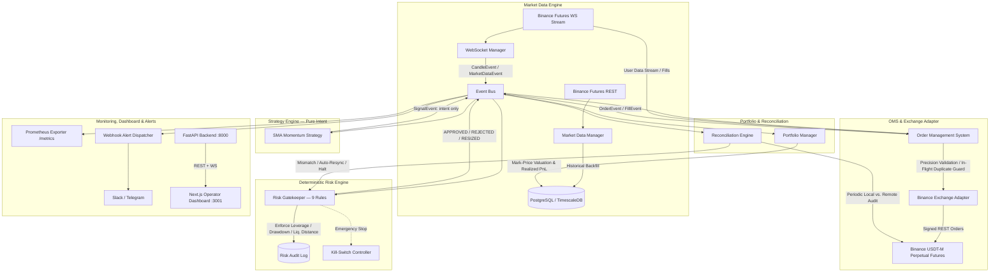

# Binance USDT-M Perpetual Futures Algorithmic Trading Platform

A modular, production-style algorithmic trading platform built from scratch — market data ingestion, strategy engine, deterministic risk gatekeeping, order management, portfolio accounting, exchange reconciliation, backtesting, and a real-time operator dashboard. Built and verified end-to-end against Binance Futures Testnet.

**This project prioritizes reliability and architecture over strategy profitability.** The included momentum strategy is intentionally simple and — as shown below — intentionally reported as unprofitable after real testing. The goal was building infrastructure a real strategy could safely run on, not chasing a backtest number.

---

## Architecture



## Engineering highlights

| Area | What was built |
|---|---|
| **Strict layering** | Strategy only emits intent; Risk can always veto/resize; OMS owns execution; Exchange Adapter owns exchange-specific logic — enforced with structural AST-based tests, not just convention |
| **Risk management** | 9 independent deterministic rules (max position size, portfolio leverage, drawdown kill-switch, liquidation distance, rate-of-trade throttling, and more) with immutable audit logging of every decision |
| **Execution correctness** | Idempotent order handling proven under genuine concurrent load (`asyncio.gather` race testing); never blindly retries a timed-out order — always reconciles against the exchange first |
| **State integrity** | Isolated-margin-per-position portfolio accounting; verified restart recovery from a genuine OS-level `SIGKILL` mid-trade with 0 reconciliation discrepancies |
| **Exchange safety** | Explicitly sets and verifies isolated margin mode + leverage against the exchange before trading — never assumes account configuration is correct |
| **Observability** | Prometheus metrics (<20µs overhead per signal), webhook alerting on critical events, structured audit logs for every risk/reconciliation decision |
| **Testing** | 144 automated unit/integration tests (100% passing, zero network dependency) + verified live execution against Binance Futures Testnet (real order round-trips, real fills, real reconciliation against exchange ground truth) |

## Honest backtest results

Two controlled experiments were run against 60 days of real BTCUSDT historical data using the platform's own backtesting engine (real fee/slippage modeling, real risk engine, in-sample/out-of-sample split). Both are reported as run — including the negative results.

| Metric | 1m Candles | 15m Candles |
|---|---|---|
| Total Return (60d) | -15.72% | -2.88% |
| Trades/day | 27.4 | 5.35 |
| Win Rate | 16.6% | 26.2% |
| Profit Factor | 0.28 | 0.65 |
| Max Drawdown | 15.92% | 3.30% |
| Buy & Hold Benchmark | +26.14% | +26.03% |

**Finding:** Moving from 1m to 15m candles cut trade frequency ~80% and transaction cost drag by a similar margin — confirming fee drag was a real cost driver at high frequency — but the strategy remained unprofitable on both timeframes. Root cause: an unconditioned SMA(9,21) crossover systematically lags during both choppy and trending markets, generating false signals that buy local tops and sell local bottoms — most visibly during the out-of-sample period's rally, where buy-and-hold returned +25.58% while the strategy returned -0.15%. Consistent in-sample/out-of-sample performance on both runs rules out overfitting to a lucky test window as the explanation.

This is reported as a finding, not a shortcoming — the platform's job was to make this experiment possible to run and trust; the strategy itself is intentionally naive.

## Known limitations / what live trading would require

This project is a testnet-verified infrastructure build, not a live trading system. Before any real capital could be involved:

- **A strategy with an actual statistical edge** — the included SMA momentum strategy does not have one, as shown above
- **Exchange IP whitelisting** for a live API key
- **Low-latency, geographically appropriate hosting** near Binance's matching engine infrastructure
- **External Prometheus/Grafana monitoring** with alerting independent of the platform's own process
- **Scheduled, offsite-replicated database backups**
- **Extended paper/testnet observation period** with the platform's own strategy (not manual test signals) generating live trade history

## Stack

Python · FastAPI · asyncio · PostgreSQL/TimescaleDB · SQLAlchemy · Alembic · Docker Compose · Next.js · React · TypeScript · Tailwind CSS · TradingView Lightweight Charts · Prometheus

## Running it

See [`RUNBOOK.md`](./RUNBOOK.md) for the full operational walkthrough — prerequisites, exact startup commands per component, what normal vs. problem logs look like, safe shutdown, and troubleshooting.

Quick start:
```bash
cp .env.example .env   # add your own Binance Futures Testnet API credentials
docker compose up -d
alembic upgrade head
pytest -v               # 144 tests, zero network/credentials required
```

## Project structure

```
src/trading_platform/
  core/          # config, logging, event bus, clock sync
  exchange/      # Exchange Adapter interface + Binance Futures implementation
  market_data/   # WebSocket ingestion, normalization, TimescaleDB persistence
  strategy/      # Strategy interface + SMA momentum implementation
  risk/          # Deterministic risk rules + kill-switch engine
  oms/           # Order Management System + execution engine
  portfolio/     # Portfolio state, PnL decomposition, isolated margin accounting
  reconciliation/# Periodic local-vs-exchange state audit
  backtest/      # Historical backtesting engine + walk-forward validation
  api/           # FastAPI monitoring/control API + WebSocket push
frontend/        # Next.js operator dashboard
tests/           # 144 tests across all subsystems
scripts/         # DB backup/restore
```


##  Demo

Watch the bot running on Binance USDT-M Testnet:

(https://github.com/Nxjndata/Vector---Crypto-Trading-Engine/blob/main/Demo.mov)
